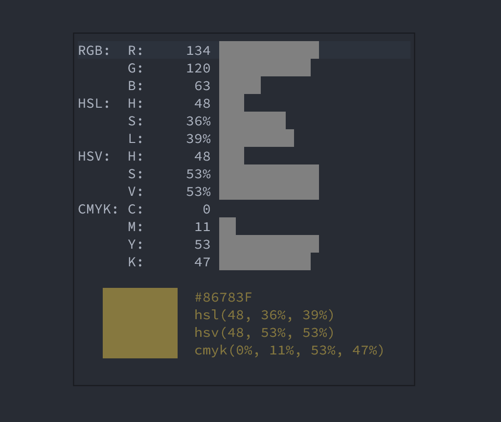

# cpicker.nvim
> A color picker for Neovim



## Install

```
Plug 'https://spacevim.org/git/repos/SpaceVim/'
Plug 'wsdjeg/cpicker.nvim'

```

## Usage

```
:Cpicker rgb hsl
```


                                          


                                              
